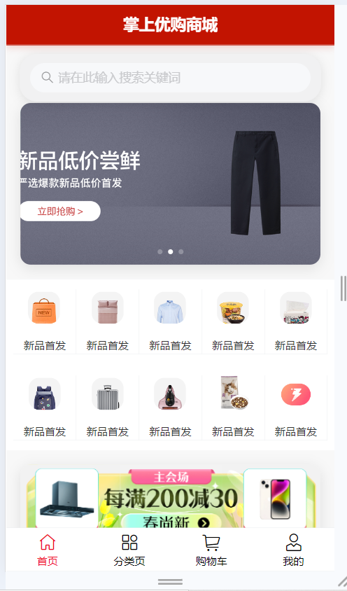
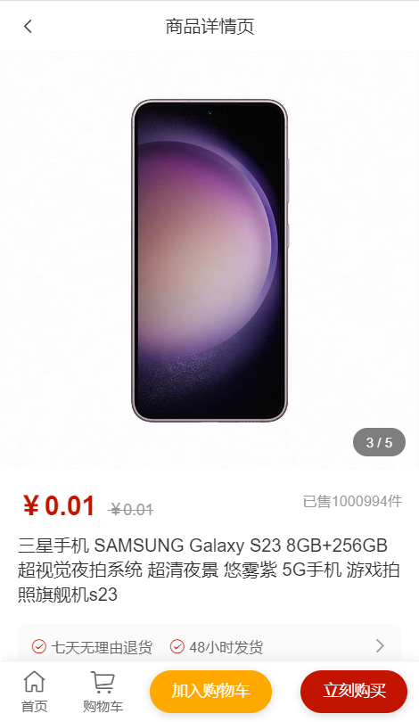
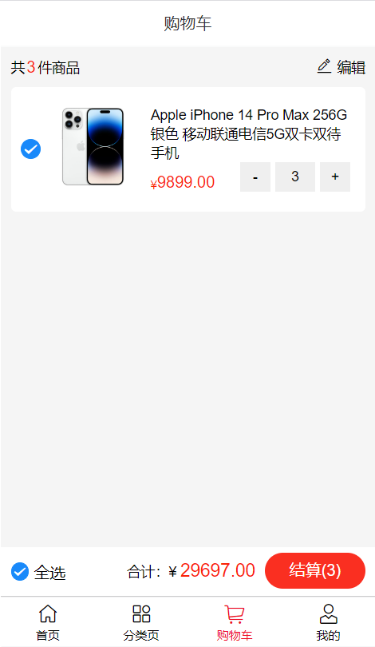
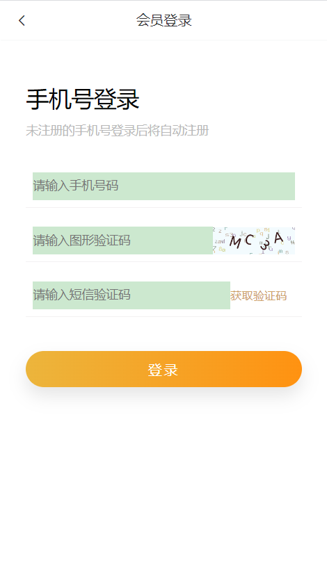

# 掌上优购商城 - 移动端电商 H5 项目

基于 Vue.js + Vant 开发的移动端电商应用，支持商品浏览、购物车管理、订单结算等核心功能。  

## 📸 项目截图

| 首页 | 商品详情 |
|------|--------|
|  |  |

| 购物车 | 登录页面 |
|------|--------|
|  |  |

> 💡 提示：所有截图均为实际运行效果

## ⚙️ 技术栈

- **前端框架**：Vue.js 2 + Vue Router + Vuex
- **UI 组件库**：Vant（按需引入）
- **网络请求**：Axios（封装拦截器）
- **构建工具**：Vue CLI
- **移动端适配**：postcss-px-to-viewport
- **状态管理**：Vuex 模块化设计

## ✨ 核心功能实现

### 1. 组件化开发
- 封装 `GoodsItem`、`CountBox` 等通用组件，复用率提升 70%
- 提高开发效率，降低维护成本

### 2. 状态统一管理
- 使用 Vuex 分模块管理用户信息与购物车数据
- 实现跨页面数据共享，避免 props 层层传递

### 3. 请求封装优化
- 封装 Axios 拦截器：
  - 自动携带 Token
  - 统一显示 Loading 动画
  - 错误提示统一处理
- 减少重复代码 40%，提高可维护性

### 4. 路由权限控制
- 使用 Vue Router 导航守卫
- 未登录用户无法访问订单、支付等敏感页面

### 5. 性能优化措施
| 优化点 | 效果 |
|-------|------|
| Vant 按需引入 | 包体积减少 18% |
| postcss-px-to-viewport | 实现多设备适配 |
| 图片懒加载 | 首屏加载速度提升 25% |


## 📦 本地运行方法

```bash
# 克隆项目
git clone https://github.com/bai1207/zhanshang-yougou.git

# 进入项目
cd zhanshang-yougou

# 安装依赖
npm install

# 启动开发服务器
npm run serve
